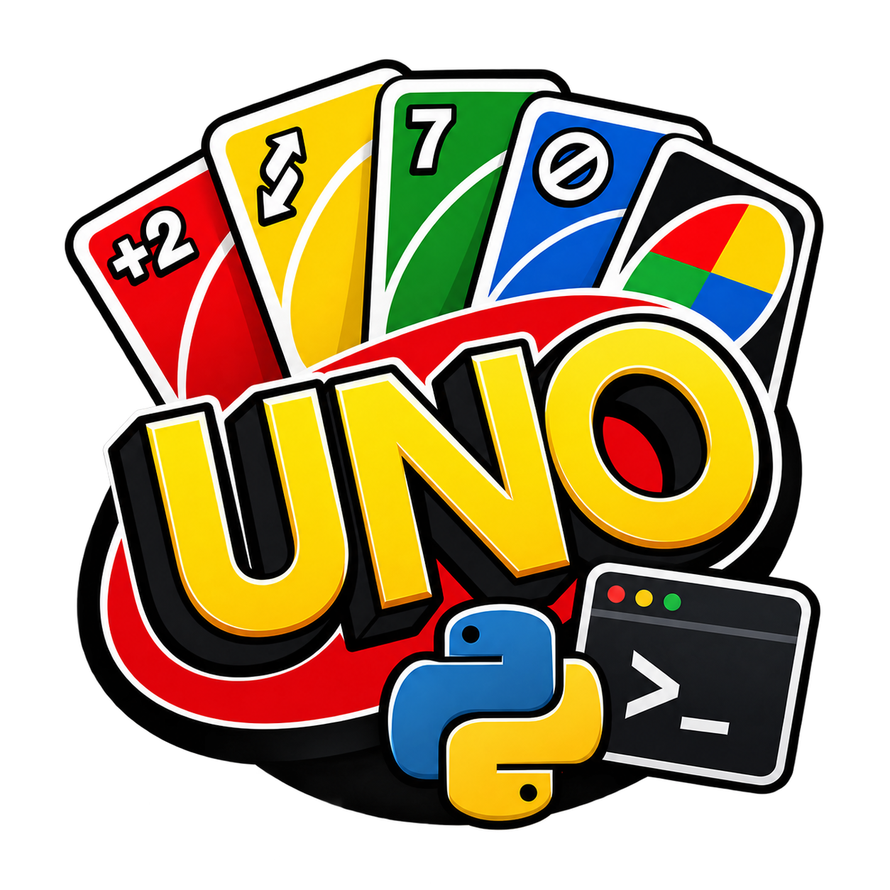

<p align="center">
  
</p>

<h1 align="center">Uno — Python</h1>

<p align="center">
  Un jeu de Uno jouable à plusieurs dans le terminal.<br>
  Projet de NSI — Terminale, Chapitre 1.
</p>

---

## Sommaire

- [Présentation](#présentation)
- [Prérequis](#prérequis)
- [Installation](#installation)
- [Lancer le jeu](#lancer-le-jeu)
- [Règles implémentées](#règles-implémentées)
- [Comment jouer](#comment-jouer)
- [Créer un exécutable (.exe)](#créer-un-exécutable-exe)
  - [Ajouter l'icône](#ajouter-licône)
- [Structure du projet](#structure-du-projet)
- [Licence](#licence)

---

## Présentation

Ce projet est une implémentation du jeu de cartes **Uno** en Python, jouable
en **hot-seat** (tous les joueurs se passent le même clavier) directement dans
le terminal. Les cartes sont affichées en couleur, et un délai entre chaque
action laisse le temps de lire ce qu'il se passe avant que l'écran ne se vide
pour le tour suivant.

Le paquet complet est généré automatiquement au lancement :

| Type de cartes | Nombre |
|---|---|
| Cartes nombres (0 à 9, 4 couleurs) | 76 |
| +2, Inversion, Passer (2 par couleur) | 24 |
| Joker et +4 | 8 |
| **Total** | **108** |

---

## Prérequis

- **Python 3.10 ou plus récent** ([télécharger ici](https://www.python.org/downloads/))
- Un terminal qui gère les couleurs ANSI
  (Windows Terminal, PowerShell, le terminal de VS Code, ou n'importe quel
  terminal Linux/macOS)

Aucune bibliothèque externe n'est nécessaire : le jeu n'utilise que la
bibliothèque standard (`random`, `os`, `time`).

---

## Installation

```bash
git clone https://github.com/SH4D0W-fr/uno-python.git
cd uno-python
```

---

## Lancer le jeu

```bash
python main.py
```

> Sur Linux / macOS, utilisez `python3 main.py`.

Au lancement, le jeu demande le nom de chaque joueur :

```
Entrez le nom du joueur suivant (X quand vous avez terminé) : Alice
Entrez le nom du joueur suivant (X quand vous avez terminé) : Bob
Entrez le nom du joueur suivant (X quand vous avez terminé) : X
```

Tapez `X` pour terminer la saisie. **Il faut au minimum 2 joueurs.**

---

## Règles implémentées

- Chaque joueur reçoit **7 cartes** au début de la partie.
- La première carte retournée est toujours une **carte nombre** (pour éviter
  d'avoir à appliquer un effet dès le premier tour).
- Une carte est jouable si elle a **la même couleur** ou **la même valeur** que
  la carte du dessus. Les jokers et les +4 sont toujours jouables.
- Si un joueur n'a aucune carte jouable, il **pioche une carte** et peut la
  jouer immédiatement si elle est valide.
- Quand la pioche est vide, la **défausse est remélangée** pour la reconstituer
  (la carte du dessus est conservée).

### Effets des cartes

| Carte | Effet |
|---|---|
| **+2** | Le joueur suivant pioche 2 cartes et passe son tour |
| **+4** | Le poseur choisit la couleur, le suivant pioche 4 cartes et passe son tour |
| **Joker** | Le poseur choisit la couleur active |
| **Passer** | Le joueur suivant perd son tour |
| **Inversion** | Inverse le sens du jeu (à 2 joueurs : équivaut à « Passer ») |

> **UNO** est annoncé automatiquement quand un joueur n'a plus qu'une carte.
> Les contre-UNO ne sont pas implémentés.

---

## Comment jouer

À chaque tour, votre main est affichée. Les cartes **jouables** sont marquées
d'une étoile `*` :

```
Main de Alice (7 cartes) :
  * [0] 5 rouge
    [1] 9 bleu
  * [2] plus2 rouge
    [3] 3 vert
  * [4] joker
  (* = carte jouable)

Numéro de la carte à jouer :
```

Entrez le **numéro entre crochets** de la carte que vous voulez poser.
Si vous posez un joker ou un +4, une liste de couleurs vous est proposée :
entrez le numéro de la couleur choisie.

La partie se termine dès qu'un joueur n'a plus aucune carte en main.

---

## Créer un exécutable (.exe)

Le projet peut être transformé en un fichier `.exe` autonome (aucun Python
requis sur la machine qui le lance) avec **auto-py-to-exe**.

### 1. Installer auto-py-to-exe

```bash
pip install auto-py-to-exe
```

### 2. Générer l'exécutable

**Option A — En une seule commande (le plus rapide) :**

```bash
pyinstaller --noconfirm --onefile --console --name "Uno" main.py
```

**Option B — Avec l'interface graphique d'auto-py-to-exe :**

```bash
auto-py-to-exe
```

Une fenêtre s'ouvre dans le navigateur. Configurez-la ainsi :

| Champ | Valeur |
|---|---|
| **Script Location** | `main.py` |
| **Onefile** | `One File` |
| **Console Window** | `Console Based` *(indispensable : le jeu est en terminal)* |
| **Icon** | `logo.ico` *(voir [Ajouter l'icône](#ajouter-licône))* |

Puis cliquez sur **CONVERT .PY TO .EXE**.

> Les fichiers `cartes.py`, `cartes_bonus.py`, `pioche.py` et `defausse.py` sont
> détectés automatiquement : il n'y a rien à ajouter dans « Additional Files ».

### 3. Récupérer le fichier

L'exécutable se trouve dans :

- `dist/Uno.exe` avec l'option A (PyInstaller),
- `output/Uno.exe` avec l'option B (auto-py-to-exe).

### Ajouter l'icône

Windows n'accepte que le format `.ico` pour les icônes d'exécutable : le PNG est
refusé. Le fichier **`logo.ico`** est déjà présent dans le dépôt (converti depuis
`logo.png`, en 16, 32, 48, 64, 128 et 256 px), il suffit donc de l'utiliser.

**Avec PyInstaller :**

```bash
pyinstaller --noconfirm --onefile --console --icon "logo.ico" --name "Uno" main.py
```

**Avec auto-py-to-exe :** dans la section **Icon**, cliquez sur « Browse » et
sélectionnez `logo.ico`.

#### Regénérer le .ico depuis le PNG

Si le logo change, il faut reconstruire le `.ico` :

```bash
pip install pillow
python -c "from PIL import Image; Image.open('logo.png').convert('RGBA').save('logo.ico', format='ICO', sizes=[(256,256),(128,128),(64,64),(48,48),(32,32),(16,16)])"
```

Le PNG source doit être **carré** et faire **au moins 256x256** px, sinon
l'icône sera déformée ou floue.

> L'icône n'apparaît que sur le fichier `.exe` dans l'explorateur Windows et dans
> la barre des tâches ; elle ne change rien à l'affichage du jeu dans le terminal.
>
> Si l'ancienne icône reste affichée après une nouvelle génération, c'est le cache
> d'icônes de Windows : renommez le `.exe` ou videz le cache avec
> `ie4uinit.exe -show`.

> Les dossiers `build/`, `dist/`, `output/` et les fichiers `.spec` sont ignorés
> par Git : ils n'ont pas à être versionnés.

---

## Structure du projet

```
uno-python/
├── main.py           # Boucle de jeu, règles, affichage et saisie
├── cartes.py         # Génération des 76 cartes nombres
├── cartes_bonus.py   # Génération des 32 cartes actions (+2, +4, joker...)
├── pioche.py         # Fonction de pioche dans le paquet
├── defausse.py       # Classe Defausse (pile des cartes posées)
├── logo.png          # Logo du projet
├── logo.ico          # Meme logo au format .ico, pour l'exe
├── LICENSE           # GNU GPL v3
└── README.md
```

### Format des cartes

Les cartes sont représentées par des **tuples** :

- Carte avec couleur : `(valeur, couleur, id)` → `(5, "rouge", 1)`, `("plus2", "vert", "2")`
- Carte sans couleur : `(valeur, id)` → `("joker", "1")`, `("plus4", "3")`

C'est la **longueur du tuple** qui permet de savoir si une carte a une couleur
ou non (voir `est_sans_couleur()` dans `main.py`).

---

## Licence

Ce projet est distribué sous licence **GNU GPL v3**. Voir le fichier
[LICENSE](LICENSE) pour le texte complet.
